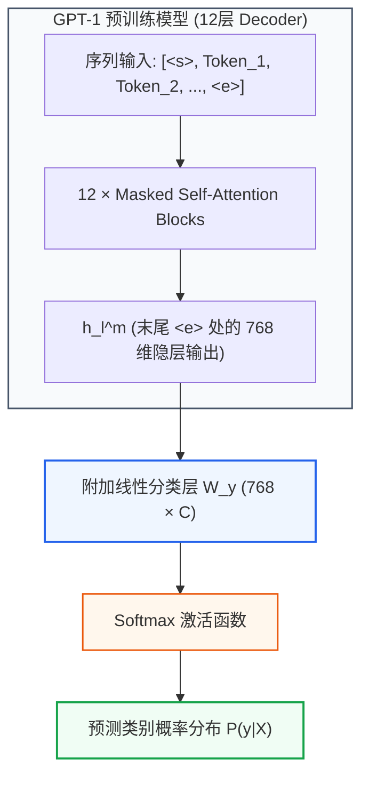

本文将**严格使用 OpenAI GPT-1 论文《Improving Language Understanding by Generative Pre-Training》中的原始超参数**：

*   **模型架构**：12 层 Decoder-only Transformer
*   **模型维度（Embedding/隐藏层）**：$d_{model} = 768$
*   **注意力头数**：$h = 12$
*   **每个头的维度**：$d_k = d_v = 768 / 12 = 64$
*   **前馈神经网络隐藏层维度**：$d_{ff} = 3072$（扩展倍率 4 倍，激活函数为 GELU）
*   **最大上下文序列长度**：$L_{max} = 512$
*   **词表大小**：$V = 40,\!000$（BPE 分词，Byte Pair Encoding）
*   **总参数量**：约 1.17 亿（117M）

为了能在平面上直观展示矩阵及其维度变换，我们假设：
*   **Batch Size ($B$) = 1**（忽略批次维度，降维为 2D 矩阵展示）
*   **无监督预训练输入序列长度 ($L$) = 4**（例如 Token 序列："Generative", "pre", "training", "works"）

---

### 总结核心矩阵流转（以预训练序列长度 $L$ 为例）

1. `[L]` (输入 Token ID) $\rightarrow$ `[L, 768]` (Token Embedding 查表)
2. `[L, 768] + [L, 768]` $\rightarrow$ `[L, 768]` (加上可学习位置编码 Learned Positional Embedding)
3. `[L, 768]` $\times$ `[768, 768]` $\rightarrow$ `[L, 768]` (生成 Q, K, V 矩阵)
4. `[L, 768]` $\rightarrow$ 切割多头 $\rightarrow$ `12个 [L, 64]`
5. `[L, 64]` $\times$ `[64, L]` $\rightarrow$ `[L, L]` (加上下三角 Causal Mask 掩码后做 Softmax)
6. `[L, L]` $\times$ `[L, 64]` $\rightarrow$ `[L, 64]` (注意力加权求和 Value)
7. 拼合 12 个头 $\rightarrow$ `[L, 768]` $\times$ `[768, 768]` $\rightarrow$ `[L, 768]` (输出线性映射 $W^O$)
8. `[L, 768] + [L, 768]` $\rightarrow$ `[L, 768]` (残差连接 Add) $\rightarrow$ LayerNorm $\rightarrow$ `[L, 768]`
9. `[L, 768]` $\times$ `[768, 3072]` $\rightarrow$ `[L, 3072]` $\rightarrow$ GELU 激活 (FFN 升维非线性变换)
10. `[L, 3072]` $\times$ `[3072, 768]` $\rightarrow$ `[L, 768]` (FFN 降维)
11. `[L, 768] + [L, 768]` $\rightarrow$ `[L, 768]` (残差连接 Add) $\rightarrow$ LayerNorm $\rightarrow$ `[L, 768]` (完成 1 个 Block，重复 12 层)
12. 最终 Block 输出 `[L, 768]` $\times$ `[768, 40000]` (与 $W_e^T$ 共享权重) $\rightarrow$ `[L, 40000]` (通过 Softmax 计算下一个 Token 的概率分布)

---

### 第一阶段：GPT-1 模型架构与矩阵流转

GPT-1 丢弃了原始 Transformer 中的 Encoder 及 Cross-Attention 部分，仅保留带有**因果掩码（Causal Mask / Masked Attention）**的 Transformer Decoder 堆叠而成。

#### 1. 词嵌入与可学习位置编码 (Embeddings)

与 Transformer 原始论文采用固定正弦/余弦位置编码不同，GPT-1 采用了**可学习的位置嵌入 (Learned Positional Embedding)**。

*   **词嵌入矩阵** $W_e \in \mathbb{R}^{V \times d_{model}} = \mathbb{R}^{40000 \times 768}$
*   **位置嵌入矩阵** $W_p \in \mathbb{R}^{L_{max} \times d_{model}} = \mathbb{R}^{512 \times 768}$

对于长度为 $L=4$ 的输入序列：

$$ h_0 = U W_e + W_p[0:L, :] $$

维度转换：`[4]` $\rightarrow$ 查表 `[4, 768]` + `[4, 768]` $\rightarrow$ **`[4, 768]`**

$$ h_0 = \begin{bmatrix} 
\leftarrow & \text{Token}_1 \text{ 词向量} + \text{Pos}_0 \text{ 位置向量} & \rightarrow \\
\leftarrow & \text{Token}_2 \text{ 词向量} + \text{Pos}_1 \text{ 位置向量} & \rightarrow \\
\leftarrow & \text{Token}_3 \text{ 词向量} + \text{Pos}_2 \text{ 位置向量} & \rightarrow \\
\leftarrow & \text{Token}_4 \text{ 词向量} + \text{Pos}_3 \text{ 位置向量} & \rightarrow 
\end{bmatrix}_{4 \times 768} $$

> [!note]- 参数规模计算
> - 词嵌入矩阵 $W_e$ 参数：$40000 \times 768 = 30,\!720,\!000$（约 3072 万参数）
> - 位置嵌入矩阵 $W_p$ 参数：$512 \times 768 = 393,\!216$（约 39.3 万参数）

---

#### 2. 掩码多头自注意力 (Masked Multi-Head Self-Attention)

每一个 Decoder Block 接收上一层的输入 $h_{l-1} \in \mathbb{R}^{4 \times 768}$。

##### Step 1: 投影生成 Q, K, V
维度转换：`[4, 768] @ [768, 768]` $\rightarrow$ `[4, 768]`

$$ Q = h_{l-1} W^Q, \quad K = h_{l-1} W^K, \quad V = h_{l-1} W^V $$

##### Step 2: 拆分多头
拆分为 $h=12$ 个独立的头，每个头特征维度 $d_k = 64$。
维度转换：`[4, 768]` $\rightarrow$ Reshape `[4, 12, 64]` $\rightarrow$ 转置 `[12, 4, 64]`。

以第 1 个注意力头 $Q_1, K_1, V_1 \in \mathbb{R}^{4 \times 64}$ 为例：

##### Step 3: 计算注意力分数与因果掩码 (Causal Masking)
自回归语言模型要求第 $i$ 个 Token 只能关注自身及左侧已生成的 Token，严禁“看到未来”。

矩阵内积：`[4, 64] @ [64, 4]` $\rightarrow$ `[4, 4]`

$$ Score_1 = \frac{Q_1 K_1^T}{\sqrt{d_k}} = \frac{Q_1 K_1^T}{8} $$

注入因果掩码矩阵 $M_{causal}$（右上角设为 $-\infty$）：

$$ MaskedScore_1 = \begin{bmatrix}
q_1 \cdot k_1 & -\infty & -\infty & -\infty \\
q_2 \cdot k_1 & q_2 \cdot k_2 & -\infty & -\infty \\
q_3 \cdot k_1 & q_3 \cdot k_2 & q_3 \cdot k_3 & -\infty \\
q_4 \cdot k_1 & q_4 \cdot k_2 & q_4 \cdot k_3 & q_4 \cdot k_4
\end{bmatrix}_{4 \times 4} $$

按行施加 Softmax 归一化后，右上角全为 0：

$$ AttentionWeights_1 = \text{Softmax}(MaskedScore_1) = \begin{bmatrix}
1.0 & 0.0 & 0.0 & 0.0 \\
0.6 & 0.4 & 0.0 & 0.0 \\
0.2 & 0.5 & 0.3 & 0.0 \\
0.1 & 0.2 & 0.3 & 0.4
\end{bmatrix}_{4 \times 4} $$

乘以 Value 矩阵进行加权求和（维度转换：`[4, 4] @ [4, 64]` $\rightarrow$ `[4, 64]`）：

$$ Z_1 = AttentionWeights_1 \times V_1 $$

##### Step 4: 多头拼接与线性映射
将 12 个头的输出在特征维度拼接：
维度转换：`12 个 [4, 64]` $\rightarrow$ Concat $\rightarrow$ `[4, 768]`

$$ Z_{concat} = [Z_1, Z_2, \dots, Z_{12}] $$

乘以输出矩阵 $W^O \in \mathbb{R}^{768 \times 768}$：

$$ Z_{final} = Z_{concat} W^O \quad \in \mathbb{R}^{4 \times 768} $$

---

#### 3. 残差连接与 Post-LN

GPT-1 沿用了原始 Transformer 的 **Post-LN** 结构（先加残差，再做层归一化）：

$$ h'_{l} = \text{LayerNorm}(h_{l-1} + \text{Dropout}(Z_{final})) $$

维度保持：`[4, 768]` $\rightarrow$ `[4, 768]`

*   **Dropout 概率**：$P_{drop} = 0.1$，仅作用于子层输出通路，不破坏残差主通路。
*   **LayerNorm**：沿最后一个维度（768 维特征）独立计算均值与方差，进行标准化并应用可学习参数 $\gamma, \beta$。

---

#### 4. 前馈神经网络 (FFN) 与 GELU 激活函数

前馈神经网络包含两次线性变换与中间的非线性激活：

$$\text{FFN}(x) = \text{GELU}(x W_1 + b_1) W_2 + b_2$$

其中：
*   $W_1 \in \mathbb{R}^{768 \times 3072}$（升维 4 倍）
*   $W_2 \in \mathbb{R}^{3072 \times 768}$（降维恢复）

##### GELU (Gaussian Error Linear Unit) 激活函数

GPT-1 使用 GELU 代替了传统 Transformer 的 ReLU。GELU 的数学定义为：

$$\text{GELU}(x) = x \cdot \Phi(x) = x \cdot P(X \le x), \quad X \sim \mathcal{N}(0, 1)$$

常用快速近似推导公式为：

$$\text{GELU}(x) \approx 0.5x \left(1 + \tanh\left(\sqrt{\frac{2}{\pi}} \left(x + 0.044715 x^3\right)\right)\right)$$

> [!tip] GELU 与 ReLU 的对比
> *   **ReLU**：在 $x<0$ 时硬裁切为 0，梯度直接归零（Dead ReLU 问题）。
> *   **GELU**：结合了随机正则化思想（按高斯概率决定保留比例）。在负数区域保留了平滑的小负值凹槽（在 $x \approx -0.75$ 处取得极小值约为 $-0.17$），处处连续一阶与二阶可导，已被证明在大规模预训练中收敛效果显著优于 ReLU。

矩阵维度流转：
1. `[4, 768] @ [768, 3072]` $\rightarrow$ **`[4, 3072]`**
2. 施加 GELU 激活函数 $\rightarrow$ `[4, 3072]`
3. `[4, 3072] @ [3072, 768]` $\rightarrow$ **`[4, 768]`**

最后再次进行残差连接与 LayerNorm：

$$ h_l = \text{LayerNorm}(h'_l + \text{Dropout}(\text{FFN}(h'_l))) $$

---

#### 5. 语言模型预训练输出头 (Output Linear & Softmax)

经过 12 层 Transformer Decoder Block 处理后，得到最终隐藏状态 $h_{12} \in \mathbb{R}^{4 \times 768}$。

为了预测每个位置的下一个 Token，将其投影回词表空间。GPT-1 采用了**权重共享 (Weight Tying)** 技术，即投影权重矩阵直接使用词嵌入矩阵的转置 $W_e^T \in \mathbb{R}^{768 \times 40000}$：

$$ Logits = h_{12} W_e^T $$

维度转换：`[4, 768] @ [768, 40000]` $\rightarrow$ **`[4, 40000]`**

对每一行取 Softmax 得到预测概率分布：

$$ P(u_i \mid u_{i-k}, \dots, u_{i-1}) = \text{Softmax}(Logits_i) $$

---

### 第二阶段：无监督预训练 (Unsupervised Pre-training)

#### 1. 优化目标 (Pre-training Loss)

给定无标注 Token 语料库 $\mathcal{U} = \{u_1, \dots, u_n\}$，预训练目标是最大化标准自回归语言模型的对数似然：

$$ L_1(\mathcal{U}) = \sum_i \log P(u_i \mid u_{i-k}, \dots, u_{i-1}; \Theta) $$

其中 $k=512$ 为上下文窗口大小，$\Theta$ 为网络参数。

#### 2. 预训练数据：BooksCorpus

GPT-1 选择 **BooksCorpus** 数据集进行预训练：
*   包含 7,000 多本未出版的独家书籍，涵盖多种文学体裁。
*   **核心优势**：包含大量**连续的长篇文本**，有利于语言模型学到长距离依赖关系。
*   **对比 ELMo**：ELMo 使用的 1B Word Benchmark 在句子级别做了打乱（Shuffle），破坏了跨句的长距离上下文结构。
*   **预训练困惑度 (Perplexity)**：GPT-1 模型在该语料库上达到了 **18.4** 的低困惑度。

#### 3. 预训练超参数与优化器设置

| 超参数 / 机制 | 配置值 | 详细说明 |
|---|---|---|
| **优化器** | Adam | $\beta_1 = 0.9, \beta_2 = 0.98, \epsilon = 10^{-9}$ |
| **最大学习率** | $2.5 \times 10^{-4}$ | 前 2000 次 update 线性 Warmup 从 0 增至峰值 |
| **学习率衰减** | Cosine Annealing | 从峰值按余弦退火逐渐衰减至 0 |
| **Batch Size** | 64 | 每个样本为 512 Token 连续序列（共 $64 \times 512 = 32,\!768$ Token/batch） |
| **训练 Epoch** | 100 epochs | 训练极为充分 |
| **权重初始化** | $\mathcal{N}(0, 0.02)$ | 由于全模型密集使用了 LayerNorm，简单的正态初始化即可稳定训练 |
| **正则化 (Weight Decay)** | Modified $L_2$ ($w = 0.01$) | 对所有非 Bias 和非 LayerNorm Gain 参数应用 Weight Decay |
| **Dropout 比例** | 0.1 | 作用于 Residual、Embedding 及 Attention 权重 |
| **文本预处理** | ftfy + spaCy + BPE | 清理异常字符，使用 40,000 Merge 次数的 Byte-Pair Encoding |

---

### 第三阶段：下游任务的输入变换与监督微调

为了避免像以往半监督方法（如 ELMo、CoVe）那样为每个下游任务额外设计复杂的自定义架构，GPT-1 提出了**遍历式输入变换 (Traversal-style Input Transformations)**：将所有结构化输入序列化为一段连续的 Token 序列，直接喂给统一的 Transformer 模型。

#### 1. 统一输入变换与 Token 结构

GPT-1 引入了三个特殊字符：
*   $\langle s \rangle$：序列起始符 (Start Token)
*   $\langle e \rangle$：序列结束符 (Extract/End Token)
*   $|$：不同子句/选项之间的分隔符 (Delimiter Token)

所有特殊 Token 的 Embedding 均在微调阶段随机初始化并参与训练。

#### 2. 四类下游任务输入构建及维度拆解

##### (1) 分类任务 (Classification)
*   **典型数据集**：CoLA (语法检查), SST-2 (情感分类)
*   **输入序列**：$[ \langle s \rangle, \text{Sequence}, \langle e \rangle ]$
*   **处理流程**：取序列最后一个 Token $\langle e \rangle$ 对应的最终隐层输出 $h_l^m \in \mathbb{R}^{1 \times 768}$，通过附加的线性分类层 $W_y \in \mathbb{R}^{768 \times C}$（$C$ 为类别数），计算 Softmax 分类概率。

##### (2) 文本蕴含 (Textual Entailment)
*   **典型数据集**：MNLI, SNLI, QNLI, RTE, SciTail
*   **输入序列**：$[ \langle s \rangle, \text{Premise (前提)}, |, \text{Hypothesis (假设)}, \langle e \rangle ]$
*   **处理流程**：将前提与假设用分隔符 $|$ 拼接为单条序列，送入模型，提取末尾 $\langle e \rangle$ 处的表示进行 3 分类（蕴含/矛盾/中立）或 2 分类。

##### (3) 语义相似度 (Semantic Similarity)
*   **典型数据集**：STSB, QQP, MRPC
*   **特点**：被比较的两句话没有固定的先后顺序。
*   **输入变换**：构造两种对称顺序的序列并独立过模型：
    $$\text{Input}_1 = [ \langle s \rangle, \text{Text}_1, |, \text{Text}_2, \langle e \rangle ] \quad \longrightarrow \quad h_{l, 1}^m \in \mathbb{R}^{768}$$
    $$\text{Input}_2 = [ \langle s \rangle, \text{Text}_2, |, \text{Text}_1, \langle e \rangle ] \quad \longrightarrow \quad h_{l, 2}^m \in \mathbb{R}^{768}$$
*   **处理流程**：将两个末尾隐层表示**按元素相加 (Element-wise Addition)** 后，送入线性分类层：
    $$ P(y) = \text{Softmax}\left((h_{l, 1}^m + h_{l, 2}^m) W_y\right) $$

##### (4) 问答与常识推理 (Question Answering & Commonsense Reasoning)
*   **典型数据集**：RACE, Story Cloze
*   **输入变换**：对于包含文章 $z$、问题 $q$ 和 $N$ 个候选选项 $\{a_1, \dots, a_N\}$ 的样本，构造 $N$ 条平行序列：
    $$\text{Input}_k = [ \langle s \rangle, z, q, |, a_k, \langle e \rangle ], \quad k \in \{1, \dots, N\}$$
*   **处理流程**：每条序列独立经过 GPT-1 模型，提取各自末尾 $\langle e \rangle$ 处的隐层向量 $h_{l, k}^m$。通过同一个线性层 $W_y \in \mathbb{R}^{768 \times 1}$ 投影为标量得分，最后在 $N$ 个选项间做 Softmax 归一化：
    $$ P(a_k \mid z, q) = \frac{\exp(h_{l, k}^m W_y)}{\sum_{j=1}^N \exp(h_{l, j}^m W_y)} $$

---

#### 3. 联合优化目标与辅助损失函数 (Auxiliary LM Loss)

微调阶段的常规分类交叉熵目标为：

$$ L_2(\mathcal{C}) = \sum_{(x, y)} \log P(y \mid x^1, \dots, x^m) = \sum_{(x, y)} \log \text{Softmax}(h_l^m W_y) $$

论文发现，在微调时**保留自回归语言模型作为辅助训练目标**，能带来两大好处：
1. **提升监督模型的泛化能力**（防止小数据集过拟合）。
2. **显著加速收敛**。

最终微调阶段的**联合优化目标**为：

$$ L_3(\mathcal{C}) = L_2(\mathcal{C}) + \lambda \cdot L_1(\mathcal{C}) $$

论文中将辅助损失权重设定为 **$\lambda = 0.5$**。

> [!note]- 微调阶段超参数配置
> *   **增加的参数**：仅线性分类层权重 $W_y$ 和新增特殊字符的 Embedding。
> *   **学习率**：$6.25 \times 10^{-5}$（比预训练缩小 4 倍）。
> *   **Batch Size**：32。
> *   **Epoch**：绝大多数任务仅需 **3 个 Epoch** 即可快速收敛。
> *   **Warmup**：在前 0.2% 的训练步数中进行线性 Warmup，随后线性衰减至 0。

---

### 第四阶段：实验结果、零样本分析与消融实验

#### 1. 主要基准测试结果 (SOTA 表现)

GPT-1 在评估的 **12 个主流 NLP 数据集中的 9 个上刷新了 SOTA 记录**：

*   **常识推理 (Story Cloze)**：准确率达到 **86.5%**（对比以往最佳绝对提升 **+8.9%**）。
*   **问答 (RACE)**：准确率达到 **59.0%**（对比以往最佳绝对提升 **+5.7%**）。
*   **文本蕴含 (MultiNLI)**：准确率达到 **82.1%**（绝对提升 **+1.5%**）。
*   **语法可接受性 (CoLA)**：得分达到 **45.4**（对比以往最佳 35.0 大幅跃升 **+10.4**）。
*   **GLUE 综合基准**：总分达到 **72.8**（显著超越此前最佳的 68.9）。

---

#### 2. 零样本行为 (Zero-Shot Behaviors) 探究

论文提出假设：**生成式预训练模型在无监督学习过程中，为了更好地预测下一个词，已经隐式地学会了执行多种 downstream 任务的能力。**

为了验证这一点，作者在不进行任何监督微调的前提下，设计启发式规则测试预训练模型的 Zero-Shot 能力：

##### 启发式设计方案：
1. **CoLA (语法判别)**：计算语言模型给该句子分配的平均 Token Log 概率，通过阈值判断句子是否合乎语法。
2. **SST-2 (情感分析)**：在文本后追加单词 `very`，限定语言模型仅在 `positive` 和 `negative` 两个词上输出概率，选择概率较高者。
3. **RACE (问答)**：在给定 Context 和 Question 条件下，计算各个 Option 选项的平均 Token Log 概率，选择概率最大者。
4. **DPRD (代词消歧/Winograd)**：将代词替换为两个候选实体，比较语言模型对替换后后续序列分配的平均 Log 概率。

> [!important] 结论
> 随着预训练 Step 的增加，Zero-Shot 性能呈**平滑、稳定上升**趋势。相比之下，LSTM 架构的 Zero-Shot 波动方差极大。这证明了 **Transformer 架构具有更优越的归纳偏置 (Inductive Bias)**，能够更好地积累通用语言知识。

---

#### 3. 消融实验 (Ablation Studies)

论文通过消融实验（如表所示）验证了各个组件的关键价值：

| 模型变体 (Model Variant) | 平均分 (Avg) | CoLA | SST2 | MRPC | STSB | QQP | MNLI | QNLI | RTE |
|---|---|---|---|---|---|---|---|---|---|
| **GPT-1 完整模型 (w/ aux LM)** | **74.7** | 45.4 | 91.3 | 82.3 | 82.0 | **70.3** | **81.8** | **88.1** | **56.0** |
| **无预训练 (w/o pre-training)** | 59.9 | 18.9 | 84.0 | 79.4 | 30.9 | 65.5 | 75.7 | 71.2 | 53.8 |
| **无辅助 LM 损失 (w/o aux LM)** | 75.0 | **47.9** | **92.0** | **84.9** | **83.2** | 69.8 | 81.1 | 86.9 | 54.4 |
| **用单层 LSTM 替代 Transformer** | 69.1 | 30.3 | 90.5 | 83.2 | 71.8 | 68.1 | 73.7 | 81.1 | 54.6 |

##### 关键结论拆解：
1. **预训练的绝对必要性 (w/o pre-training)**：去掉无监督预训练直接在下游数据集上训练，平均分暴跌 **14.8%**（59.9 vs 74.7），证明无监督预训练是模型强大泛化能力的基石。
2. **Transformer vs LSTM 架构对比**：用单层 2048 单元的 LSTM 替换 Transformer，平均分下降 **5.6 分**，表明 Transformer 处理长距离依赖和结构化记忆的能力远超循环网络。
3. **辅助 LM 损失的作用 (w/o aux LM)**：辅助损失对大规模数据集（如 MNLI, QQP）提升明显；小数据集上无辅助损失甚至略高，但总体辅助损失有助于大模型的稳定泛化。

---

### 第五阶段：GPT-1 参数量拆解与配置速查

#### 1. GPT-1 (117M) 参数量精确速算

| 组件类型 | 单个参数维度 / 计算公式 | 数量 | 参数量 (Millions) |
|---|---|---|---|
| **Token Embedding ($W_e$)** | $40000 \times 768$ | 1 | 30.72 M |
| **Learned Pos Embedding ($W_p$)** | $512 \times 768$ | 1 | 0.39 M |
| **Attention 投影 ($W^Q, W^K, W^V, W^O$)** | $4 \times (768 \times 768)$ | 12 层 | $12 \times 2.36\text{M} = 28.31\text{M}$ |
| **FFN 升维与降维 ($W_1, W_2$)** | $(768 \times 3072) + (3072 \times 768)$ | 12 层 | $12 \times 4.72\text{M} = 56.62\text{M}$ |
| **LayerNorm 参数 ($\gamma, \beta$)** | $2 \times (2 \times 768)$ | 12 层 | 0.037 M |
| **微调分类头 ($W_y$)** | $768 \times C$（依任务而定） | 1 | $< 0.01\text{M}$ |
| **全模型总参数量** | — | — | **约 1.17 亿 (116.07M + Head)** |

> [!note] FFN vs MHA 参数占比
> 在每个 Block 中，FFN 的参数量（$4.72\text{M}$）是 Multi-Head Attention（$2.36\text{M}$）的 **2 倍**。全模型约 49% 的参数集中在前馈神经网络层中。

---

#### 2. Transformer vs GPT-1 核心机制速查表

| 特性对比 | 原始 Transformer (2017) | GPT-1 (2018) |
|---|---|---|
| **基本架构** | Encoder-Decoder | **Decoder-only** |
| **自注意力机制** | Encoder 全向 / Decoder 掩码 | **严格因果掩码 (Masked Self-Attention)** |
| **位置编码** | 固定正弦/余弦 (Sinusoidal) | **可学习位置嵌入 (Learned Positional)** |
| **激活函数** | ReLU | **GELU** |
| **归一化位置** | Post-LN | **Post-LN** |
| **核心范式** | 端到端Seq2Seq (如机器翻译) | **生成式预训练 (Pre-train) + 判别式微调 (Fine-tune)** |
| **下游适配** | 重新设计解码器 / 架构 | **遍历式输入变换 (字符串拼接 + 统一模型架构)** |
| **目标任务** | 机器翻译、句法分析 | **NLI, QA, 语义相似度, 文本分类等广义 NLI 任务** |
